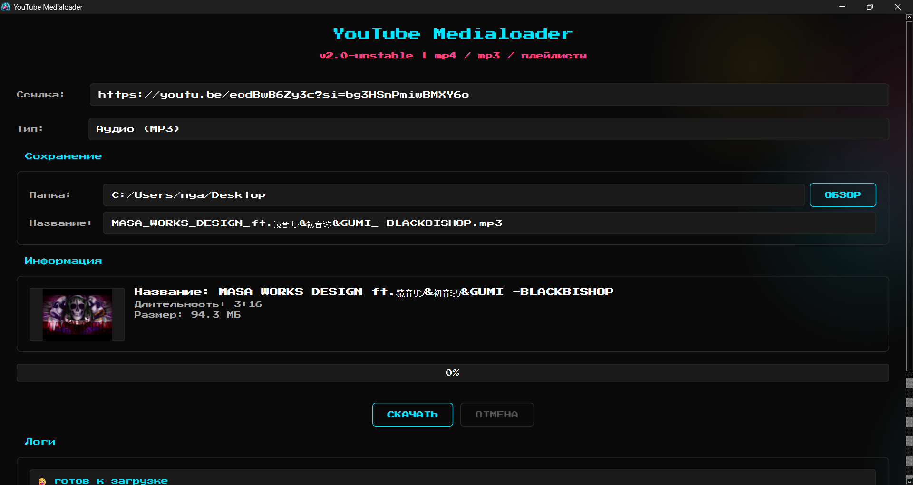
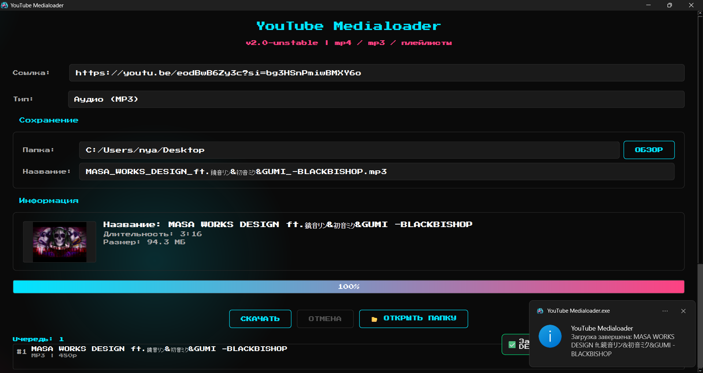
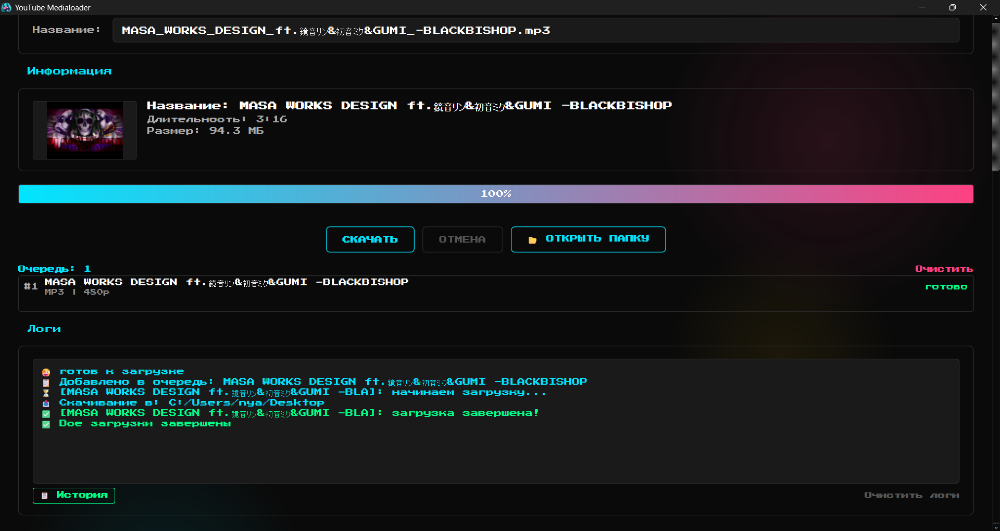

<div align="center">
  
   <h1>YouTube Medialoader 🎈</h1>
   <p><b><i>Десктоп-приложение для скачивания видео и аудио с YouTube </br>ヾ(＠⌒ー⌒＠)ノ</i></b></p>
   <a href="https://www.python.org"></a>
   <a href="https://www.qt.io/qt-for-python"></a>
   <a href="https://github.com/yt-dlp/yt-dlp"></a>
   <br/>
   <a href="https://github.com/MindlessMuse666/yappari/blob/main/LICENSE.md"></a>
   <a href="https://www.microsoft.com/windows"></a>
</div>

---

## Общее описание

**YouTube Medialoader** - это десктопное приложение для скачивания видео (MP4) и аудио (MP3) с YouTube. Предпросмотр меты, обложка видео, выбор качества, очередь загрузки, поддержка плейлистов - и всe локально ✨

---

## Возможности

| Функция | Описание |
| --- | --- |
| 🎥 **Видео MP4** | Скачивание видео в 1080p / 720p / 480p |
| 🎵 **Аудио MP3** | Извлечение аудиодорожки в лучшем качестве |
| 🔍 **Предпросмотр** | Название, длительность, размер файла, обложка видео до загрузки |
| 📋 **Плейлисты** | Обнаружение плейлистов, выбор видео для загрузки |
| 🗂 **Очередь загрузки** | Добавление нескольких видео в очередь, последовательная загрузка |
| 🖼 **Обложка видео** | Отображение миниатюры видео в блоке предпросмотра |
| 📜 **История загрузок** | Таблица завершенных загрузок с возможностью открыть папку |
| 🚀 **Фоновые потоки** | Загрузка и получение информации в отдельных QThread |
| ⏹ **Отмена** | Прерывание загрузки в любой момент с удалением временного файла |
| 📊 **Расширенный прогресс** | Скорость, ETA и размер файла в реальном времени |
| 🎨 **Неоновая тема** | Анимированный темный фон, голубые акценты `#00E5FF`, розовые `#FF4081` |
| ⌨️ **Шорткаты** | `Ctrl+V`, `Enter`, `Escape`, `Ctrl+O`, `Ctrl+L` |
| 🖱 **Drag & Drop** | Перетаскивание ссылки из браузера прямо в окно |
| 🗂 **Открыть папку** | Кнопка открытия папки с файлом после загрузки |
| 🧩 **Системный трей** | Сворачивание в трей, уведомления о завершении |
| 🔄 **Проверка обновлений** | Автоматическая проверка новой версии на GitHub при старте |
| 🪶 **Легкий** | Минимум зависимостей: Python + PySide6 + yt-dlp |

---

## Скриншоты

### 🏠 После указания ссылки



### 🎉 Медиа успешно скачано




---

## Стек технологий

### Backend / Core

- **Python 3.12+** - язык разработки
- **PySide6 6.11** - нативный GUI (Qt6 для Python)
- **yt-dlp** - движок загрузки с YouTube
- **QThread** - асинхронные задачи

### UI

- **QSS** - кастомные стили
- **Press Start 2P** - локальный `.ttf` шрифт
- **QPropertyAnimation** - плавные анимации (fade-in, слайд-ин, раскрытие)
- **Animated Background** - градиентные сферы для глубины фона
- **QSystemTrayIcon** - системный трей с уведомлениями
- **QNetworkAccessManager** - асинхронная загрузка обложек и проверка обновлений
- **Drag & Drop** - поддержка перетаскивания ссылок из браузера

### Desktop

- **PyInstaller** - сборка в standalone EXE

---

## Быстрый старт

### Требования

- Windows 10/11
- Python 3.12+
- [FFmpeg](https://ffmpeg.org/download.html) (для MP3-конвертации и слияния видео+аудио)

### Шаги запуска

```powershell
# 1. склонируй репозиторий
git clone https://github.com/MindlessMuse666/youtube-medialoader.git
cd youtube-medialoader

# 2. создай виртуальное окружение и установи зависимости
py -m venv .venv
.venv\Scripts\activate
pip install -r requirements.txt

# 3. запусти приложение
py -m src.main
```

### Сборка EXE

```powershell
# 1. перейди в .venv
.venv\Scripts\activate

# 2. если pyinstaller еще не установлен, то сделай это
pip install pyinstaller

# 3. собери бинарь командой
.\.venv\Scripts\pyinstaller --noconfirm --clean --onefile --windowed --name "YouTube Medialoader" --icon "assets\icons\app_icon.ico" --add-data "assets;assets" --collect-all "yt_dlp" --optimize 2 --exclude-module tkinter --exclude-module unittest --exclude-module pydoc --hidden-import "src.gui" --hidden-import "src.utils" --hidden-import "src.gui.animated_background" --hidden-import "src.gui.styles" --hidden-import "src.gui.widgets" --hidden-import "src.gui.worker" --hidden-import "src.gui.download_queue" --hidden-import "src.gui.playlist_dialog" --hidden-import "src.gui.history_dialog" --hidden-import "src.utils.file_utils" --hidden-import "src.utils.logger" --hidden-import "src.utils.history" --hidden-import "src.utils.update_checker" "src\main.py"
```

> Готовый `.exe` появится в папке `dist/`.

---

## Разработка

### Структура проекта

```text
youtube-medialoader/
├── src/                       # Исходный код
│   ├── main.py                # Точка входа
│   ├── downloader.py          # Движок загрузки (yt-dlp wrapper)
│   ├── gui/
│   │   ├── main_window.py     # Главное окно (MainWindow)
│   │   ├── widgets.py         # NeonButton, Toast, ProgressBar, Spinner
│   │   ├── styles.py          # QSS-стили + загрузка шрифтов
│   │   ├── worker.py          # QThread-задачи (VideoInfoWorker, DownloadWorker, PlaylistWorker)
│   │   ├── animated_background.py  # Анимированные сферы на фоне
│   │   ├── download_queue.py  # Виджет очереди загрузки
│   │   ├── playlist_dialog.py # Диалог выбора видео из плейлиста
│   │   └── history_dialog.py  # Диалог истории загрузок
│   └── utils/
│       ├── file_utils.py      # Очистка имен файлов, пути
│       ├── logger.py          # Qt-логгер с сигналами
│       ├── history.py         # Менеджер истории (QSettings + JSON)
│       └── update_checker.py  # Проверка обновлений на GitHub
├── assets/
│   ├── fonts/                 # PressStart2P-Regular.ttf
│   └── icons/                 # app_icon.ico, app_icon.png
├── tests/
│   ├── test_downloader.py     # Тесты загрузчика (моки yt-dlp)
│   ├── test_file_utils.py     # Тесты утилит
│   ├── test_worker.py         # Тесты worker-ов
│   └── conftest.py            # Фикстуры pytest
├── pyproject.toml             # Метаданные и конфигурация
├── requirements.txt           # Зависимости
├── BUILD.md                   # Гайд по сборке EXE
└── README.md                  # Этот файл
```

### Команды

| Команда                           | Описание               |
| --------------------------------- | ---------------------- |
| `py -m src.main`                  | Запуск приложения      |
| `pytest tests/ -v`                | Запуск тестов          |
| `pip install -r requirements.txt` | Установка зависимостей |

### Тестирование

Проект покрыт модульными тестами с моками - никаких реальных сетевых запросов:

```bash
pytest tests/ -v --tb=short
```

---

## Лицензия

Проект распространяется под лицензией [GNU AGPL v3](LICENSE.md).

---

<div align="center">
  
  <br>
  <sub><b>YouTube Medialoader // Видео и аудио с YouTube</b></sub>
  <br>
  <sup><i>made with ❤️ by <a href="https://github.com/MindlessMuse666" target="_blank">MindlessMuse666</a></i></sup>
</div>
